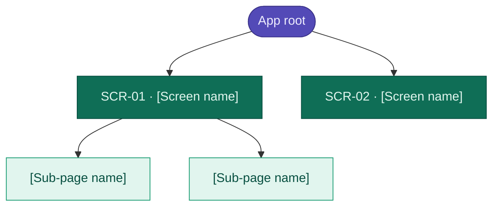
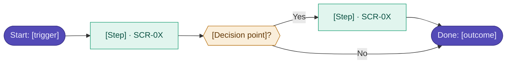

# Phase 4 — Information Architecture

> **Instruction file for Claude Code.**
> Execute this phase after Phase 3 is complete. Output goes to `[project]-ux/research/04-ia.md`.
> **After this phase:** create `[project]-ux/screens/` and generate per-screen spec files.

---

## Purpose

Define how the product is structured, labelled, and navigated — before any visual design. IA decisions directly shape wireframe layouts. The finalised screen inventory from this phase triggers the creation of the `screens/` folder.

---

## Inputs

- `[project]-ux/00-master-spec.md` — all REQ-IDs
- `[project]-ux/research/01-discovery.md` — draft screen inventory
- `[project]-ux/research/02-user-research.md` — vocabulary table
- `[project]-ux/research/03-synthesis.md` — personas, insights, mental models

---

## Execution Steps

### Step 1 — Card sorting

List every feature, content type, and section that appears in the V1 scope. Group them into user-meaningful categories based on research mental models.

Rules:

- Use the vocabulary from Phase 2 — not internal product terminology
- Groups should reflect how users think, not how the system is built
- Aim for 3–6 top-level groups — fewer is better

### Step 2 — Build the sitemap

Produce the sitemap as both a Mermaid diagram and a text tree.

**Mermaid diagram rules:**

- Use `flowchart TD` (top-down)
- Colour-code by navigation level using `classDef`
- Purple = app root entry point
- Dark green (filled) = primary nav destinations (L1 screens with a SCR-ID)
- Light green (outlined) = sub-pages and views (L2, no standalone SCR-ID)
- Grey = utility / system screens (error states, empty states)
- Node label format: `"SCR-01 · Screen name"` for screens with IDs, plain label for sub-views

**Text tree rules:**

- Indent by navigation level
- Every L1 screen gets a SCR-ID
- Sub-pages without their own SCR-ID are indented under their parent
- Flag orphaned screens (no clear parent) — these are IA bugs

### Step 3 — Define navigation model

State the primary navigation pattern explicitly. Choose one:

- Left sidebar (persistent) + content area
- Top navigation bar + content area
- Hub-and-spoke (home screen links to all sections)
- Bottom tab bar (mobile)
- Other — justify the choice

For each primary navigation destination, map it to its SCR-ID.

### Step 4 — Map critical user paths

For each critical path identified in Phase 3 (primary jobs to be done), draw a Mermaid flowchart.

**One diagram per critical path.** Do not put all paths in one diagram.

Mermaid flowchart rules:

- Direction: `flowchart LR` (left to right)
- In-product screens: filled green nodes `["SCR-ID · Name"]`
- Decision points: double-bracket nodes `{{"Decision?"}}`
- Start/end terminals: rounded nodes `(["Start"])` / `(["Done"])`
- External steps (email, third-party): grey nodes
- Apply `classDef` colour-coding consistently

### Step 5 — Finalise labelling decisions

Using the vocabulary table from Phase 2, confirm which user terms replace internal terms in all UI copy. Document every labelling decision explicitly.

### Step 6 — Finalise screen inventory

Update the draft screen inventory from Phase 1 based on the sitemap. This is the confirmed list. Every screen here will get a spec file in the `screens/` folder.

### Step 7 — Write the output file and create screen specs

After writing `[project]-ux/research/04-ia.md`:

1. Create the `[project]-ux/screens/` folder
2. For each SCR-ID in the finalised inventory, create `SCR-[ID]-[screen-name].md` using the Per-Screen Spec Template at the bottom of this file

---

## Output Template

````markdown
# Phase 4 — Information Architecture
Product: [product name]
Date: [date]

---

## Card Sort Results

### Features and content grouped

| Group | Items included | Navigation label |
| ----- | -------------- | ---------------- |
| [group name] | [feature 1, feature 2, ...] | [label to use in nav] |

---

## Sitemap



### Screen inventory (text tree)

```text
[Root]
├── SCR-01  [Screen name]
│   ├── [Sub-page]
│   └── [Sub-page]
├── SCR-02  [Screen name]
└── SCR-03  [Screen name]
```

---

## Navigation Model

**Pattern:** [Left sidebar / Top bar / Hub-spoke / Bottom tabs]
**Justification:** [Why this pattern fits the user type and use context]

**Primary navigation destinations:**

| Label | SCR-ID | Always visible? |
| ----- | ------ | --------------- |
| [Nav label] | SCR-01 | Yes |

---

## Critical User Paths

### Path 01 — [Path name, e.g. "New user onboarding"]



### Path 02 — [Path name]
[same structure]

---

## Labelling Decisions

| Internal / assumed term | User vocabulary (Phase 2) | Confirmed UI label |
| ----------------------- | ------------------------- | ------------------ |
| [internal term] | "[what users say]" | Use "[label]" |

---

## Finalised Screen Inventory

| SCR-ID | Screen name | IA level | Parent | REQ-IDs | Notes |
| ------ | ----------- | -------- | ------ | ------- | ----- |
| SCR-01 | [name] | L1 | Root | REQ-FUNC-001 | |
| SCR-02 | [name] | L1 | Root | REQ-FUNC-005 | |

**Total confirmed screens:** [N]

> The screens/ folder is created immediately after this inventory is confirmed.
````

---

## Per-Screen Spec Template

Use this template for every file created in `[project]-ux/screens/SCR-[ID]-[screen-name].md`.

````markdown
# Screen Spec — SCR-[ID] [Screen Name]

## Identity
- **Screen ID:** SCR-[ID]
- **Screen name:** [name]
- **Version:** 1.0
- **Status:** [ ] Wireframe | [ ] Wireframe approved | [ ] Mockup | [ ] Mockup approved

---

## Requirements Fulfilled

| REQ-ID | Requirement | Priority |
| ------ | ----------- | -------- |
| REQ-FUNC-001 | [requirement] | M |

---

## User Context

- **Primary persona:** [persona name]
- **Primary job:** "[JTBD statement for this screen]"
- **Context:** [device, time of day, mental state, competing tasks]

---

## IA Position

- **Location:** Root > [path]
- **Accessible from:** [list of entry points]
- **Links to:** [list of destinations]

---

## Design Principle Applied

"[Principle name]" — [one sentence on how it applies to this screen]

---

## Content Model

```text
[Screen name]
├── [Section / component]
│     content: [what data is shown]
│     states: [populated | empty | loading]
│     action: [what the user can do]
├── [Section / component]
│     content:
│     states:
│     action:
└── [Section / component] (conditional — describe trigger)
      content:
      states:
      action:
```

---

## States to Design

| State | Trigger | Key visual difference |
| ----- | ------- | --------------------- |
| Default | [normal condition] | [description] |
| Empty — first use | [no data exists] | [empty state + CTA] |
| Loading | [initial page load] | [skeleton state] |
| Error | [failure condition] | [error message + recovery action] |

---

## Wireframe Constraints

- **Grid:** 12-column desktop (or [other] if different)
- **Layout:** [describe layout pattern]
- **Max content width:** [value]
- **Spacing:** All from `spacing/` variable scale — no raw values

---

## Mockup Constraints

- **Components used:** [list components from the component library]
- **Key colour tokens:** [e.g. color/feedback/error for blocker indicator]
- **Elevation:** [e.g. elevation-1 for cards]

---

## Acceptance Criteria

- [ ] All states designed and annotated
- [ ] Spec annotation panel includes all REQ-IDs
- [ ] WCAG AA contrast on all text/background combinations
- [ ] [screen-specific criterion]
- [ ] [screen-specific criterion]

---

## Open Questions

- [ ] [question] → needs answer from: [owner]
````
